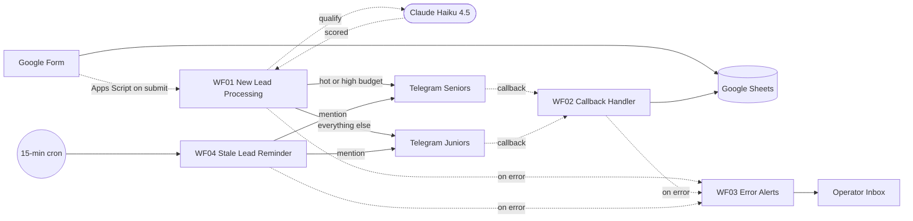

# Lead Automation — n8n Portfolio Case

Form → AI-qualified → smart-routed → Telegram-actioned, end-to-end in under 60 seconds.

A four-workflow n8n Cloud system that ingests Google Form leads, validates and dedupes them, qualifies them with Claude Haiku 4.5, routes by AI category + budget tier into one of two manager chats, and lets managers update status with one tap — synced back to the source Sheet and visible to the team in real time. A 15-minute cron pings any un-claimed lead with an `@manager` mention.

---

## Demo

[](https://www.loom.com/share/8cf0cf463db848ac9ef6144b2f3c801f)

*Form submit → Telegram alert with an AI-scored header → manager taps "Claim" → status updates in the Google Sheet, and the message edits in place.*

🎥 **Walkthrough:** https://www.loom.com/share/8cf0cf463db848ac9ef6144b2f3c801f

---

## Stack


---

## Architecture



Full architectural overview, integration model, idempotency strategy, AI integration pattern, and recovery model in [`docs/architecture.md`](docs/architecture.md).

---

## WOW Features

| # | Feature | What it does | Why it matters |
|---|---------|--------------|----------------|
| 1 | **AI Qualification** | Claude Haiku scores each lead 1-10 in hot/warm/cold with a 10-word reason, in the lead's own language (UA/RU/EN). Telegram message gets a color-coded header. | Managers triage at a glance — they don't read the full message body for cold leads. Cost: ~$0.0004 per qualification. |
| 2 | **Smart Routing** | Hot leads or leads with budget ≥ $1500 land in the Seniors group. Everything else → Juniors. Routing is decided once in Format Message based on AI category + budget, then a Switch node fans out. | Senior managers see only high-value leads; junior managers focus on volume + warm-up work. Decision is one source of truth, persisted as `routed_to` in the Sheet. |
| 3 | **Stale-Lead Reminder with `@mention`** | If a lead sits in `status='new'` for > 30 min, a cron pings the routed chat (Seniors or Juniors) with `@manager_username` — Telegram delivers a personal notification badge for the named manager. Includes the full 3-button inline keyboard so action still works from the reminder. | Forces accountability. A regular reminder in a group chat is easy to ignore; an `@mention` lights up the named manager's notification badge specifically. |

---

## Project Structure

```
lead-automation/
├── workflows/                          # JSON exports of each workflow, committed to git
│   ├── 01-new-lead-processing.json
│   ├── 02-callback-handler.json
│   ├── 03-error-alerts.json
│   └── 04-stale-lead-reminder.json
├── docs/
│   ├── architecture.md                 # how the system works
│   ├── google-sheets-schema.md         # column-by-column reference for all 3 Sheet tabs
│   └── screenshots/                    # README assets including demo.gif
├── scripts/
│   └── apps-script-webhook.gs          # optional Apps Script bridge (drafted, not deployed)
├── .env.example                        # required env vars with comments
├── .gitignore
├── README.md
└── LICENSE
```

---

## Case Narrative

**The problem.** SMB clients (salons, dance studios, marketing agencies) lose 30%+ of inbound leads to slow first-touch response. They have a Google Form, a Telegram group, and managers who check both irregularly. Manual triage = lost revenue.

**The architectural decisions worth noting.**

1. **n8n Cloud over self-hosted.** Counterintuitive for a "show your ops chops" portfolio piece — but the case study is meant to be *read*, not redeployed. Cloud is the lower-risk, lower-overhead choice for a private demo instance and the workflow JSON is portable if a client later wants self-hosted. [Rationale](docs/architecture.md#4-why-n8n-cloud).
2. **`anyUpdate` Sheets Trigger over `rowAdded`.** Discovered during testing: `rowAdded` captures rows as soon as the first cell is filled, then never re-fires for that row. With humans typing cells one at a time directly in Sheets, this loses leads. `anyUpdate` re-fires per cell change — paired with an "already processed" guard in Check Duplicate, it's idempotent and tolerant of partial-row state during entry.
3. **AI as enhancement, not critical path.** Parse AI Response catches every JSON error and falls back to `{ score: 0, category: 'cold', reason: 'parse_error' }`. The principle: a real lead reaching Telegram is more important than a clean qualification label.
4. **Three independent idempotency guards** rather than one shared one — email-dedup, `telegram_message_id`-already-set, and `reminder_sent_at` — because they address three different re-entry scenarios (new-row vs cell-edit vs cron-retry) and the failure modes don't overlap.

**The result.** End-to-end latency ~5–60 seconds from form submit to Telegram message. AI scoring observed at 9/10 hot for explicit-intent Ukrainian leads, 1-3 cold for "just browsing", warm in between — across English, Ukrainian, and Russian inputs. Buttons are idempotent (double-clicks are safe). Errors surface within 60 seconds via email with sanitized payloads and a direct link to the failed execution.

---

## Competencies Demonstrated

- **Agentic architecture** — four workflows, each with a single responsibility, wired together by callback contracts (`callback_data` format `lead_{rowId}_{action}`) and a shared Sheet for state. The Telegram-message-ID linkage between WF01 (send) and WF02 (edit) is the most subtle part of the design and is documented as such.
- **Workflow craft** — each workflow is single-responsibility, version-controlled as JSON in `workflows/`, validated against n8n's runtime contract before deploy, and smoke-tested with real callbacks. The callback contract (`callback_data` format `lead_{rowId}_{action}`) is the API between WF01 (sender) and WF02 (handler) and is documented in `docs/architecture.md`.
- **Context & reliability** — error handling via dedicated WF03 with payload sanitization, idempotent loops with write-after-success guards, fail-soft AI integration that never blocks a real lead, and a `_config` sheet as the runtime knob for routing thresholds + reminder timing.
- **AI integration** — Anthropic Claude Haiku 4.5 with deterministic JSON output (`temperature: 0`, hard `max_tokens` cap), defensive JSON parsing with strip-fences-then-parse-then-fallback, bilingual prompt cues to handle Cyrillic intent words correctly, and cost-monitored to stay under $0.001 per qualification.

---

## License

MIT — see `LICENSE`.
